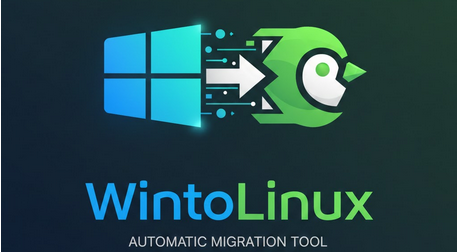

# WinToLinux-Migration
<p align="center">
  
  
  
  
  
  
</p>
<p align="center">
  
</p>
Assistant complet de migration Windows → Linux  
(sauvegarde, ISO, clé USB bootable, restauration, post-installation)
Assistant de migration Windows → Linux (sauvegarde, ISO, clé USB, restauration)

# WinToLinux-Migration  
(sauvegarde, ISO, clé USB bootable, restauration, post-installation)

## 🎯 Objectif du projet
* **Analyse du système** : Diagnostic complet de l'environnement Windows actuel.
* **Sauvegarde automatique** : Archivage sécurisé de vos données personnelles.
* **Préparation OS** : Téléchargement de l'ISO Linux et création d'une clé USB bootable.
* **Rapport de migration** : Génération d'un rapport détaillé au format HTML.
* **Post-installation** : Scripts Linux pour la restauration et la configuration automatique.

## 🚀 Pourquoi utiliser WinToLinux ?
Ce projet vise à simplifier la transition pour les utilisateurs, tout en offrant un outil professionnel pour les techniciens.

# Automated Setup: Windows & Linux Environment

<p align="center">
  
</p>

<p align="center">
  
  
  
  
</p>

A powerful, cross-platform automation suite to deploy and configure your development environments on both Windows and Linux.

## ✨ Key Features

* **Smart Deployment**: Automated installation of apps, runtimes, and tools.
* **Unified Logic**: Consistent setup whether you are on PowerShell or Bash.
* **Detailed Logging**: Every action is timestamped and stored for auditing.
* **Safety First**: Integrated rollback system in case of installation failure.

## 🛡️ Security & Reliability

This tool is designed with a **"Safe-Fail"** philosophy:

1. **Comprehensive Logs**: All output is redirected to `./logs/setup_YYY-MM-DD.log`.
2. **Rollback System**: If a critical step fails, the script automatically triggers a cleanup or reverts changes to keep your system stable.
3. **Dry Run (Optional)**: Test the configuration before applying changes.

## 🚀 Quick Start

```bash
# For Linux users
git clone [https://github.com/votre-pseudo/Automatisation-PowerShell-Bash.git](https://github.com/votre-pseudo/Automatisation-PowerShell-Bash.git)
cd Automatisation-PowerShell-Bash
chmod +x install.sh
./install.sh
